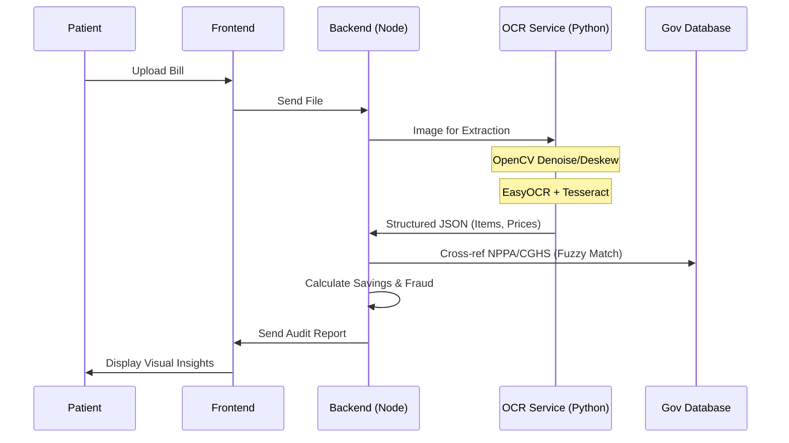

<p align="center">
  <a href="https://github.com/Rachit-Kakkad1/medclear">
    
  </a>
</p>

<div align="center">

# 📰 MEDCLEAR: EXPOSING THE MEDICAL BILLING FRAUD

**Surgical Precision in Auditing Medical Overcharges. Built for Truth.**

[](https://github.com/Rachit-Kakkad1/medclear)
[](https://github.com/Rachit-Kakkad1/medclear/blob/main/LICENSE)
[](https://www.figma.com/design/7IhpULI3UQ5F2U0MQe1Z1j/Untitled?node-id=0-1&t=T80jNlhQRdtqB0BP-1)
[](https://github.com/Rachit-Kakkad1/medclear)

---

### 🏥 *"We found line-items marked as 'Administrative Comfort' costing patients ₹12,000 for a single bed-sheet change."*

---

### 🚀 **MISSION CRITICAL LINKS**

<p align="center">
  <a href="https://med-clear-teal.vercel.app" target="_blank">
    
  </a>
  &nbsp;
  <a href="https://youtu.be/3myQG6IWQeY?si=Zl8bqMDGx-8gQ7SF" target="_blank">
    
  </a>
  &nbsp;
  <a href="https://www.figma.com/design/7IhpULI3UQ5F2U0MQe1Z1j/Untitled?node-id=0-1&t=T80jNlhQRdtqB0BP-1" target="_blank">
    
  </a>
</p>
<p align="center">
  <a href="https://documenter.getpostman.com/view/50840748/2sBXqKnfF7" target="_blank">
    
  </a>
  &nbsp;
  <a href="https://medclear-backend.onrender.com" target="_blank">
    
  </a>
</p>

---

</div>

---

## 🚨 THE PROBLEM: THE HIDDEN LOOT

Every year, millions of patients are handed "ransom notes" instead of clear medical invoices. Hospitals often unbundle procedures to hide 800%+ markups on basic supplies, exploiting the lack of transparency in healthcare billing.

**MedClear** is an **AI-powered healthcare billing audit tool** that detects overcharging in hospital bills using cutting-edge OCR and intelligent price comparison against NPPA + CGHS government pricing standards.

> **Think of it as a "TurboTax for medical bills"** — upload your hospital bill, and MedClear instantly tells you if you've been overcharged, where, and by exactly how much.

---

## ✨ KEY CAPABILITIES

-   **📄 Deep OCR Audit**: Drag-and-drop support for JPG, PNG, or PDF. Extracts every hidden line-item with high precision.
-   **🖼️ Image Preprocessing**: Auto-rotates, deskews, and sharpens blurry or crumpled hospital bills using OpenCV.
-   **🔍 Government Sync**: Real-time cross-referencing with NPPA/CGHS price ceilings using fuzzy-matching algorithms.
-   **⚠️ Fraud Detection**: Specialized logic engines designed to catch duplicate charges and unbundled procedures.
-   **💰 Savings Report**: Generates beautiful, downloadable PDF reports with itemized savings breakdowns.
-   **📱 Central Dashboard**: Secure history of all uploaded bills and their historical audit results.
- **🗺️ Jan Aushadhi Map**: Find nearby generic medicine stores to save even more.

---

## 📸 VISUAL TOUR (SCREENSHOTS)

Explore the surgical UI/UX design of MedClear. Each interface is engineered to provide devastating clarity and inspire trust.

### 🏠 1. Landing Page (The Entryway)
> *The mission-critical interface where patients learn about the "Great Hospital Heist" and start their audit journey.*
<p align="center">
  
</p>

### 📊 2. Patient Dashboard (The Command Center)
> *A high-level overview of all audited bills, total savings, and historical fraud trends.*
<p align="center">
  
</p>

### 📤 3. Upload Bill Page (The Extraction Zone)
> *The intelligent dropzone where bills are uploaded, pre-processed, and fed into the OCR engine.*
<p align="center">
  
</p>

### ⚖️ 4. Detailed Reports Page (The Evidence)
> *The granular breakdown of every line-item, showing exactly where the overcharges occurred.*
<p align="center">
  
</p>

### 💡 5. AI Insights Page (The Intelligence)
> *Deep-dive analytics into billing patterns, department efficiency, and fraud risk scores.*
<p align="center">
  
</p>

### 🏛️ 6. Government Data Hub (The Standard)
> *Direct access to NPPA/CGHS price ceilings and nearby Jan Aushadhi generic store mapping.*
<p align="center">
  
</p>

---

## 🎨 DESIGN & PROTOTYPING (FIGMA)

The entire UI/UX of MedClear was meticulously designed in **Figma** before a single line of code was written. Every screen, interaction, and micro-animation was prototyped to deliver a newspaper-inspired, investigative aesthetic.

<p align="center">
  <a href="https://www.figma.com/design/7IhpULI3UQ5F2U0MQe1Z1j/Untitled?node-id=0-1&t=T80jNlhQRdtqB0BP-1" target="_blank">
    
  </a>
</p>

| Design Aspect | Details |
| :--- | :--- |
| **Design Tool** | Figma |
| **Design System** | Newspaper/Editorial theme with warm tan palette + dark mode |
| **Typography** | Playfair Display (headings) + Inter (body) |
| **Color Palette** | `#E3D5CA` · `#C8B6A6` · `#8D7B68` · `#D9230F` · `#0F0F0F` |
| **Components** | Dashboard, Upload, Reports, Insights, Gov Schemes, Jan Aushadhi Map |

> 🔗 **Figma Link**: [https://www.figma.com/design/7IhpULI3UQ5F2U0MQe1Z1j](https://www.figma.com/design/7IhpULI3UQ5F2U0MQe1Z1j/Untitled?node-id=0-1&t=T80jNlhQRdtqB0BP-1)

---

## 🛠️ THE ARSENAL (TECH STACK)

<table width="100%">
  <tr>
    <td width="33%" align="center">
      <br><br>
      <h3>🎨 FRONTEND</h3>
      <p align="left">
        • <b>React 19 + Vite 8</b><br>
        • <b>Tailwind 4</b> (CSS-first)<br>
        • <b>Three.js (R3F)</b>: 3D Dashboards<br>
        • <b>GSAP & Framer Motion</b><br>
        • <b>Lenis</b>: Smooth Scrolling
      </p>
    </td>
    <td width="33%" align="center">
      <br><br>
      <h3>⚙️ BACKEND</h3>
      <p align="left">
        • <b>Node.js (Express 5)</b><br>
        • <b>MongoDB (Mongoose)</b><br>
        • <b>JWT & OAuth 2.0</b><br>
        • <b>Winston</b>: Logic Logging<br>
        • <b>Helmet & Rate Limit</b>
      </p>
    </td>
    <td width="33%" align="center">
      <br><br>
      <h3>🤖 AI & OCR</h3>
      <p align="left">
        • <b>Python (FastAPI)</b><br>
        • <b>EasyOCR & Tesseract</b><br>
        • <b>OpenCV</b>: Pre-processing<br>
        • <b>Levenshtein</b>: Fuzzy Matching<br>
        • <b>Pandas</b>: Data Processing
      </p>
    </td>
  </tr>
</table>

---

## 📂 DIRECTORY STRUCTURE

```text
📦 medclear
 ┣ 📂 frontend/                  # 🎨 React Application (Vite, Tailwind, Three.js)
 ┃ ┣ 📂 src/
 ┃ ┃ ┣ 📂 components/            # UI Blocks (frames, insights, upload)
 ┃ ┃ ┣ 📂 pages/                 # Route-level views (Dashboard, Map, etc.)
 ┃ ┃ ┣ 📂 services/              # API clients & hooks
 ┃ ┃ ┗ 📜 main.jsx               # Entry point
 ┃
 ┣ 📂 backend/                   # ⚙️ Node.js API (Express, Mongoose)
 ┃ ┣ 📂 src/
 ┃ ┃ ┣ 📂 controllers/           # Request handlers
 ┃ ┃ ┣ 📂 models/                # DB Schemas (Bills, Schemes, Stores)
 ┃ ┃ ┣ 📂 services/              # Logic (Audit, OCR Bridge, Auth)
 ┃ ┃ ┗ 📜 app.js                 # App configuration
 ┃ ┗ 📜 server.js                # Server bootstrap
 ┃
 ┣ 📂 ocr-service/               # 🤖 Python Microservice (FastAPI, EasyOCR)
 ┃ ┣ 📂 app/
 ┃ ┃ ┣ 📂 services/              # OCR & Image Processing logic
 ┃ ┃ ┗ 📜 main.py                # FastAPI Entry
 ┃ ┗ 📜 requirements.txt         # Dependencies
```

---

## 🧠 HOW THE ENGINE WORKS



---

## 🚀 INSTALLATION & SETUP

### 1️⃣ Prerequisites
- **Node.js** (v18+)
- **Python** (v3.10+)
- **MongoDB** (Local or Atlas)
- **Tesseract OCR** (Host machine installation required)

### 2️⃣ Clone the Repository
```bash
git clone https://github.com/Rachit-Kakkad1/medclear.git
cd medclear
```

### 3️⃣ Configure Environment Variables
You need to set up `.env` files in both `backend` and `frontend` directories.

**Backend (`/backend/.env`):**
```env
PORT=5000
MONGODB_URI=your_mongodb_uri
JWT_SECRET=your_jwt_secret
GOOGLE_CLIENT_ID=your_google_id
OCR_SERVICE_URL=http://localhost:8000/ocr/extract
FRONTEND_URL=http://localhost:5173
```

**Frontend (`/frontend/.env`):**
```env
VITE_API_URL=http://localhost:5000
VITE_GOOGLE_CLIENT_ID=your_google_id
VITE_MAPPLS_API_KEY=your_key
```

### 4️⃣ Start the Engines (Parallel)

| Service | Commands |
| :--- | :--- |
| **Backend** | `cd backend && npm install && npm run dev` |
| **Frontend** | `cd frontend && npm install && npm run dev` |
| **OCR Service** | `cd ocr-service && python -m venv venv && source venv/bin/activate && pip install -r requirements.txt && uvicorn app.main:app --host 0.0.0.0 --port 8000 --reload` |

> **Note:** On Windows, use `venv\Scripts\activate` for the OCR service.

---

## 📊 LIVE DATA BENCHMARKS

| 🩺 PROCEDURE / IMPLANT | 🏥 HOSPITAL AVG | 🏛️ GOVT. CEILING | 🚨 THE OVERCHARGE |
| :--- | :--- | :--- | :--- |
| **Cardiac Stent** | <strike>₹1,20,000</strike> | **₹35,000** | <span style="color:red">**+₹85,000 (242%)**</span> |
| **Knee Implant** | <strike>₹95,000</strike> | **₹42,000** | <span style="color:red">**+₹53,000 (126%)**</span> |
| **Ceftriaxone 1g Inj.** | <strike>₹850</strike> | **₹45** | <span style="color:red">**+₹805 (1788%)**</span> |

---

## 🔮 NEXT PHASE: FUTURE STEPS

The following features are planned for future releases to further enhance healthcare transparency:

- [ ] 🏥 **Prescription Scanner**: Detect medication overpricing in real-time.
- [ ] 🛡️ **Insurance Integration**: One-click dispute filing with insurance providers.
- [ ] 🤖 **AI Legal Assistant**: Generate localized legal notices for hospitals.
- [ ] 📈 **Crowdsourced Pricing**: Community-driven hospital pricing database.

---

<div align="center">
  
  <br><br>
  <b>© 2026 MedClear Gazette. The truth is free. Auditing is mandatory.</b>
  <br><br>
  <a href="#top">Back to top ⬆️</a>
</div>
