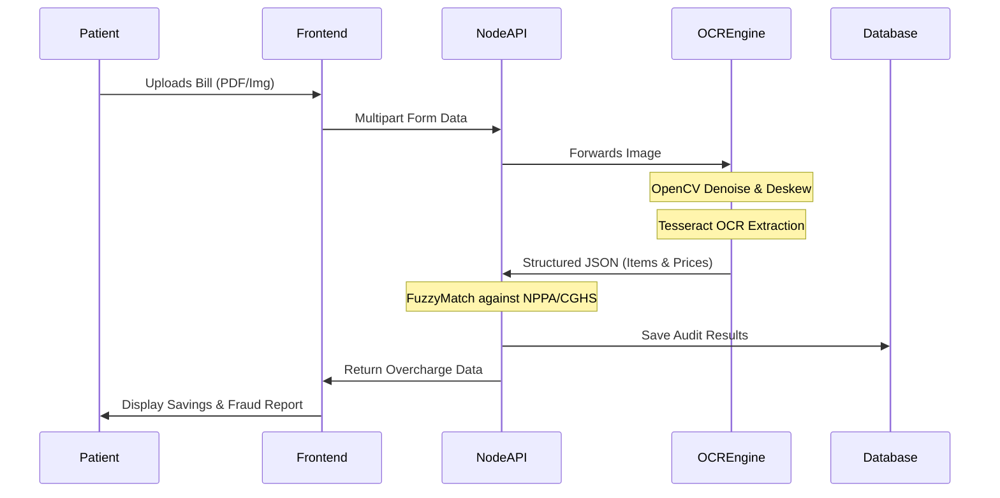

<p align="center">
  <a href="https://github.com/Rachit-Kakkad1/medclear">
    
  </a>
</p>

<div align="center">

# 📰 MEDCLEAR: THE GREAT HOSPITAL HEIST EXPOSED

**Surgical Precision in Auditing Medical Overcharges. Built for Truth.**

<p align="center">
  <a href="https://github.com/Rachit-Kakkad1/medclear"></a>
  <a href="https://github.com/Rachit-Kakkad1/medclear/blob/main/LICENSE"></a>
  <a href="https://www.figma.com/design/7IhpULI3UQ5F2U0MQe1Z1j/Untitled?node-id=0-1&t=T80jNlhQRdtqB0BP-1"></a>
  <a href="https://github.com/Rachit-Kakkad1/medclear"></a>
  <a href="https://github.com/Rachit-Kakkad1/medclear/stargazers"></a>
</p>

---

### 🏥 *"We found line-items marked as 'Administrative Comfort' costing patients ₹12,000 for a single bed-sheet change."*

</div>

---

## 🎨 THE BLUEPRINT (FIGMA)

<p align="center">
  <a href="https://www.figma.com/design/7IhpULI3UQ5F2U0MQe1Z1j/Untitled?node-id=0-1&t=T80jNlhQRdtqB0BP-1">
    
  </a>
</p>

<div align="center">
  <kbd>
    <a href="https://www.figma.com/design/7IhpULI3UQ5F2U0MQe1Z1j/Untitled?node-id=0-1&t=T80jNlhQRdtqB0BP-1">
      
    </a>
  </kbd>
  <br><br>
  <em>Explore the surgical UI/UX design that powers MedClear's investigative experience. Every pixel is engineered to inspire trust and deliver devastating clarity.</em>
</div>

---

## 🚨 SPECIAL INVESTIGATIVE REPORT: THE LOOT

MedClear is an **AI-powered healthcare billing audit tool** that detects overcharging in hospital bills using cutting-edge OCR (Optical Character Recognition) and intelligent price comparison against NPPA + CGHS government pricing standards.

> **Think of it as a "TurboTax for medical bills"** — upload your hospital bill, and MedClear instantly tells you if you've been overcharged, where, and by exactly how much.

### THE EVIDENCE:
*   ❌ **Hidden Charges**: Hospitals unbundling procedures to hide 800%+ markups on basic supplies.
*   ❌ **Zero Transparency**: Patients are handed "ransom notes" instead of clear, benchmarked invoices.
*   ✅ **The MedClear Solution**: Surgical extraction of every line-item, automatically mapped to government-mandated price ceilings.

---

## 🛠️ THE ARSENAL (COMPREHENSIVE TECH STACK)

We chose each technology in MedClear based on **performance, developer experience, and relentless scalability**.

<table width="100%">
  <tr>
    <td width="33%" align="center">
      <br><br>
      <h3>🎨 FRONTEND</h3>
      <p align="left">
        • <b>React 18 + Vite</b>: Blazing fast rendering.<br>
        • <b>TypeScript</b>: Bulletproof static typing.<br>
        • <b>Tailwind CSS</b>: Utility-first styling.<br>
        • <b>Framer Motion & GSAP</b>: Fluid animations.<br>
        • <b>Three.js</b>: 3D interactive elements.<br>
        • <b>Zustand</b>: Lightweight state management.
      </p>
    </td>
    <td width="33%" align="center">
      <br><br>
      <h3>⚙️ BACKEND</h3>
      <p align="left">
        • <b>Node.js + Express</b>: Event-driven API.<br>
        • <b>MongoDB</b>: Flexible NoSQL document storage.<br>
        • <b>Prisma</b>: Type-safe, next-gen ORM.<br>
        • <b>JWT & Zod</b>: Auth and strict validation.<br>
        • <b>Redis (Queue)</b>: Background job handling.
      </p>
    </td>
    <td width="33%" align="center">
      <br><br>
      <h3>🤖 AI & OCR INTELLIGENCE</h3>
      <p align="left">
        • <b>Python + FastAPI</b>: High-performance async API.<br>
        • <b>Tesseract OCR</b>: Battle-tested text extraction.<br>
        • <b>OpenCV</b>: Image deskewing and denoising.<br>
        • <b>FuzzyWuzzy</b>: Smart algorithmic mapping.<br>
        • <b>Pandas</b>: Government data processing.
      </p>
    </td>
  </tr>
</table>

---

## 📂 THE ARCHITECTURE (DIRECTORY STRUCTURE)

A highly modular, scalable monorepo designed for separation of concerns and rapid iteration.

```text
📦 medclear
 ┣ 📂 frontend/                  # 🎨 React/Vite Application
 ┃ ┣ 📂 public/                  # Static assets, icons, sample bills
 ┃ ┣ 📂 src/
 ┃ ┃ ┣ 📂 assets/                # Images, vectors, and heavy media
 ┃ ┃ ┣ 📂 components/            # Reusable UI building blocks
 ┃ ┃ ┃ ┣ 📂 frames/              # Specialized layout frames
 ┃ ┃ ┃ ┣ 📂 insights/            # Data visualization components
 ┃ ┃ ┃ ┣ 📂 reports/             # PDF generation and report UI
 ┃ ┃ ┃ ┗ 📂 upload/              # File dropzones, OCR progress UI
 ┃ ┃ ┣ 📂 pages/                 # Top-level route components
 ┃ ┃ ┣ 📂 utils/                 # API clients, helpers, scroll logic
 ┃ ┃ ┣ 📜 App.jsx                # Main application router
 ┃ ┃ ┣ 📜 index.css              # Global Tailwind styles
 ┃ ┃ ┗ 📜 main.jsx               # React DOM entry point
 ┃ ┣ 📜 eslint.config.js         # Linting rules
 ┃ ┣ 📜 vite.config.js           # Vite bundler configuration
 ┃ ┗ 📜 vercel.json              # Deployment configuration
 ┃
 ┣ 📂 backend/                   # ⚙️ Node.js/Express API
 ┃ ┣ 📂 src/
 ┃ ┃ ┣ 📂 config/                # Database & environment configurations
 ┃ ┃ ┣ 📂 controllers/           # Request/Response handlers
 ┃ ┃ ┣ 📂 middlewares/           # Auth, error handling, file upload
 ┃ ┃ ┣ 📂 models/                # Mongoose database schemas
 ┃ ┃ ┣ 📂 routes/                # API endpoint definitions
 ┃ ┃ ┣ 📂 services/              # Core business logic (Audit, OCR triggers)
 ┃ ┃ ┗ 📂 utils/                 # Loggers, cache, queue processors
 ┃ ┣ 📜 app.js                   # Express app setup
 ┃ ┣ 📜 server.js                # Server entry point
 ┃ ┗ 📜 clear_cache.js           # Utility script
 ┃
 ┣ 📂 ocr-service/               # 🤖 Python/FastAPI Microservice
 ┃ ┣ 📂 app/
 ┃ ┃ ┣ 📂 routers/               # FastAPI endpoints
 ┃ ┃ ┣ 📂 services/              # Tesseract/OpenCV logic
 ┃ ┃ ┗ 📂 utils/                 # Image preprocessing, noise filters
 ┃ ┣ 📜 main.py                  # FastAPI entry point
 ┃ ┣ 📜 requirements.txt         # Python dependencies
 ┃ ┣ 📜 Dockerfile               # Containerization blueprint
 ┃ ┗ 📜 verify_pipeline.py       # ML pipeline testing script
 ┃
 ┗ 📜 README.md                  # You are here 📍
```

---

## ⚙️ SURGICAL FEATURES

| 🛠️ Capability | 📝 Description |
| :--- | :--- |
| **📄 Deep OCR Audit** | Drag-and-drop support for JPG, PNG, or PDF. Extracts every hidden line-item. |
| **🖼️ Image Preprocessing** | Auto-rotates, deskews, and sharpens blurry or crumpled hospital bills. |
| **🔍 Government Sync** | Real-time, fuzzy-matched cross-referencing with NPPA/CGHS price ceilings. |
| **⚠️ Fraud Detection** | Logic engines designed to catch duplicate charges and unbundled procedures. |
| **💰 Savings Report** | Generates beautiful, downloadable PDF reports with itemized savings breakdowns. |
| **📱 Central Dashboard** | Secure history of all uploaded bills and their historical audit results. |

---

## 🧠 HOW THE ENGINE TEARS THROUGH LIES



---

## 📊 THE NUMBERS DON'T LIE (LIVE DATA SAMPLE)

| 🩺 PROCEDURE / IMPLANT | 🏥 HOSPITAL AVG | 🏛️ GOVT. CEILING | 🚨 THE OVERCHARGE |
| :--- | :--- | :--- | :--- |
| **Cardiac Stent** | <strike>₹1,20,000</strike> | **₹35,000** | <span style="color:red">**+₹85,000 (242%)**</span> |
| **Knee Implant** | <strike>₹95,000</strike> | **₹42,000** | <span style="color:red">**+₹53,000 (126%)**</span> |
| **ICU Day Care** | <strike>₹25,000</strike> | **₹6,000** | <span style="color:red">**+₹19,000 (316%)**</span> |
| **Ceftriaxone 1g Inj.** | <strike>₹850</strike> | **₹45** | <span style="color:red">**+₹805 (1788%)**</span> |

---

## 🚀 STANDARD OPERATING PROCEDURES (SETUP)

### 1️⃣ Prerequisites
Ensure you have the following installed:
- **Node.js** (v18+)
- **Python** (v3.9+)
- **MongoDB** (Local or Atlas)
- **Tesseract OCR** (Installed on host machine)

### 2️⃣ Clone the Bureau's Archive
```bash
git clone https://github.com/Rachit-Kakkad1/medclear.git
cd medclear
```

### 3️⃣ Deploy Frontend
```bash
cd frontend
npm install
npm run dev
# Starts on http://localhost:5173
```

### 4️⃣ Deploy Backend API
```bash
cd ../backend
npm install
# Create a .env file with your MONGO_URI and JWT_SECRET
npm run dev
# Starts on http://localhost:3000
```

### 5️⃣ Activate OCR Intelligence
```bash
cd ../ocr-service
python -m venv venv
source venv/Scripts/activate # or venv/bin/activate on Mac/Linux
pip install -r requirements.txt
uvicorn app.main:app --reload
# Starts on http://localhost:8000
```

---

## 🔮 THE FUTURE OF TRANSPARENCY (ROADMAP)

- [ ] 🏥 **Prescription Scanner**: Analyze doctor prescriptions for medication overpricing.
- [ ] 🛡️ **Insurance Integration**: Auto-submit generated audit reports to insurance providers.
- [ ] 📈 **Real-time Pricing**: Live API webhook integration from NPPA for the absolute latest drug prices.
- [ ] 🤖 **AI Legal Drafter**: Auto-generate localized legal dispute letters based on the exact overcharges found.
- [ ] 📱 **Mobile App**: Native iOS and Android applications using React Native / Expo.

---

## 🤝 JOIN THE INVESTIGATION (CONTRIBUTING)

We welcome whistleblowers, developers, and designers.
1. Fork the Project
2. Create your Feature Branch (`git checkout -b feature/AmazingFeature`)
3. Commit your Changes (`git commit -m 'Add some AmazingFeature'`)
4. Push to the Branch (`git push origin feature/AmazingFeature`)
5. Open a Pull Request

---

<div align="center">
  
  <br><br>
  <b>© 2026 MedClear Gazette. The truth is free. Auditing is mandatory.</b>
  <br><br>
  <a href="#top">Back to top ⬆️</a>
</div>